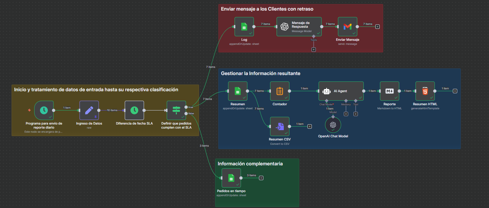

# 🧩 README – Flujo n8n: Ejercicio 1

## 📋 Descripción general

Este flujo automatiza el monitoreo de pedidos y cumplimiento de SLA.
Cada día, revisa los pedidos, calcula los días sin actualización, y:
    -   Registra los resultados en Google Sheets.
    - Envía mensajes empáticos a clientes con pedidos demorados (fuera de SLA).
    - Guarda los casos “en tiempo” en otra hoja.
    - Genera un reporte HTML y archivo CSV con el resumen del día.

### ⚙️ Variables y credenciales requeridas

Elemento                | Tipo              | Descripción                                                                             |
| ----------------------- | ----------------- | --------------------------------------------------------------------------------------- |
| `Google Sheets account` | Credencial OAuth2 | Permite escribir y actualizar registros en hojas de cálculo.                            |
| `Gmail account`         | Credencial OAuth2 | Usada para enviar correos automáticos de reporte.                                       |
| `OpenAi account`        | Credencial API    | Utilizada por el nodo “Message a model” para generar mensajes empáticos personalizados. |

### 🧾 Datos de entrada simulados

Nodo: Ingreso de Datos
Define un conjunto de pedidos de ejemplo (JSON) con campos:

### 🚀 Pasos del flujo

1. Programa para envío diario
    - Nodo tipo Schedule Trigger: ejecuta el flujo automáticamente cada día.

2. Ingreso de Datos
    - Carga o recibe los pedidos a procesar.

3. Diferencia de fecha SLA
    - Calcula los días transcurridos entre timestamp y last_update.
    - Resultado: campo days_since_update.

4. If (Condición SLA)
    - Evalúa si days_since_update.days > sla_days.
    - Si se cumple → Fuera de SLA.
    - Si no → En tiempo.

5. Si el pedido supera el SLA, continúa por la rama True; de lo contrario, por False.

| Nodo                           | Función                                                                                   |
| ------------------------------ | ----------------------------------------------------------------------------------------- |
| **Log**                        | Registra el pedido en la hoja de Google Sheets *“Fuera de SLA”*.                          |
| **Mensaje de Respuesta (GPT)** | Genera un texto empático personalizado para el cliente usando OpenAI.                     |
| **Enviar mensaje (Gmail)**     | Envía el correo con el mensaje generado.                                                  |
| **Resumen**                    | Guarda los casos fuera de SLA en la hoja *“Reporte”*.                                     |
| **Markdown (HTML Report)**     | Crea un resumen visual en formato HTML con detalle y cantidad de pedidos demorados.       |
| **Convertir a Archivo (CSV)**  | Genera un archivo CSV con los mismos datos del reporte para exportación o almacenamiento. |

6. Rama False (en tiempo)
    - Pedidos en tiempo: Registra el pedido en la hoja “Dentro de SLA”.

### 📊 Hojas de Google utilizadas

Hoja                         | URL               | Proposito                                                              |
| -----------------------    | ----------------- | ---------------------------------------------------------------------- |
| Ejercicio1 / Fuera de SLA` | Credencial OAuth2 | Permite escribir y actualizar registros.                               |
| Ejercicio1 / Lista mensajes| Credencial OAuth2 | Usada para enviar correos automáticos reporte.                         |
| Reporte diario             | Credencial API    | Utilizada por el nodo “Message a model” para generar mensajes empáticos|
|                            |                   | personalizados.                                                        |

### 🧠 Lógica de decisión principal

Si days_since_update.days > sla_days:
    -> Registrar en “Fuera de SLA”
    -> Generar mensaje al cliente (OpenAI)
    -> Enviar correo
Sino:
    -> Registrar en “Pedidos en tiempo”

## 📈 Salidas generadas
    Hoja de seguimiento actualizada con pedidos fuera de SLA.
    Correo automático enviado al cliente con tono empático.
    Reporte HTML y CSV con totales y detalle por pedido.

## Diagrama de Flujo

